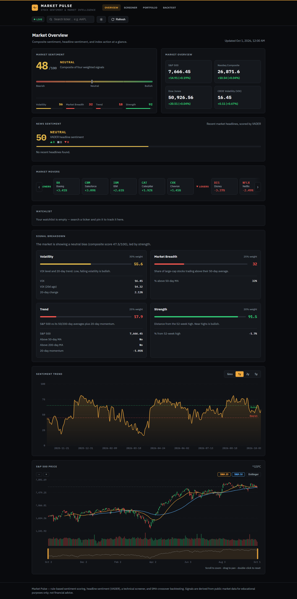
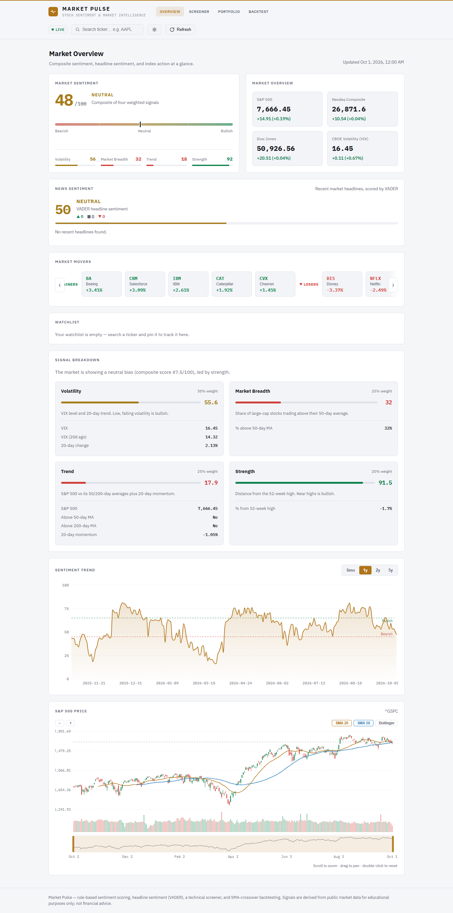
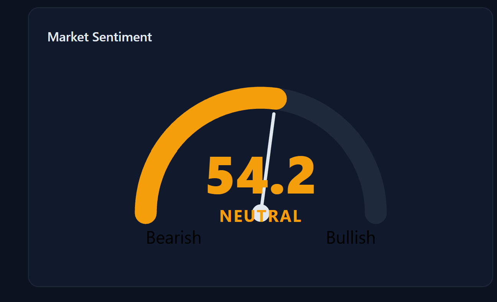
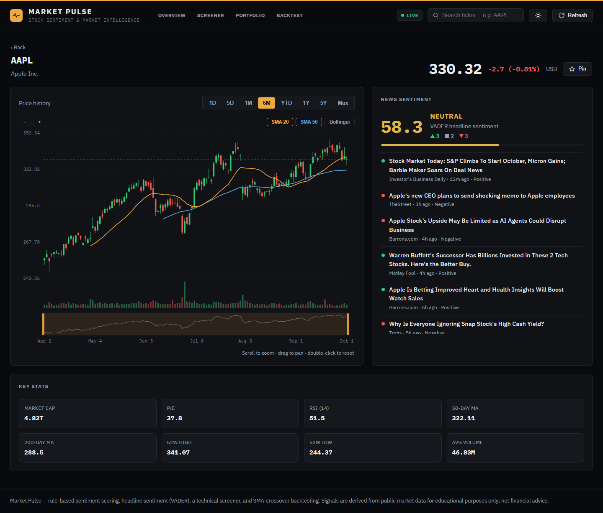
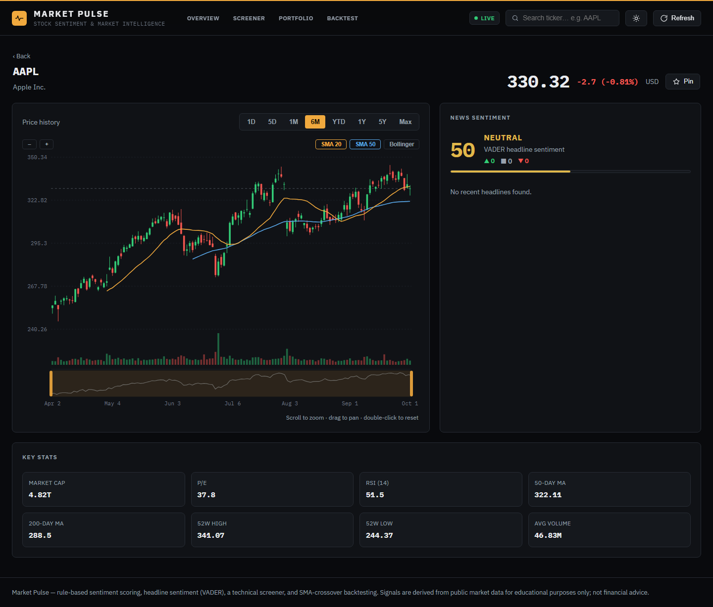
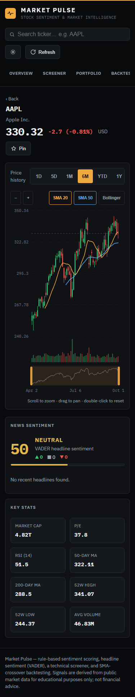

# Market Pulse — Market Sentiment Dashboard

A full-stack web application that computes a **market sentiment score** from
public market data and visualizes it in a modern dashboard. **No machine
learning** — the "forecast" is a transparent, rule-based composite of four
market signals. The project is built to showcase **web development** skill:
a clean FastAPI backend, a polished React frontend, proper API design,
caching, and solid loading/error UX.

## What it does

Four market-derived signals are each mapped to a 0–100 "bullishness" score
and blended with fixed weights into a single composite score (0–100) mapped
to **Bullish / Neutral / Bearish**:

| Signal       | Source                          | Weight |
| ------------ | ------------------------------- | ------ |
| Volatility   | VIX level + 20-day trend        | 30%    |
| Breadth      | % of large-caps above 50-day MA | 25%    |
| Trend        | S&P 500 vs 50/200-day MA + momentum | 25% |
| Strength     | Distance from 52-week high      | 20%    |

## Features

- **Market sentiment gauge** — composite score with a per-signal breakdown
- **Ticker detail page** — dedicated deep-linkable page (`#/ticker/AAPL`) with
  quote, candlestick + volume chart, and key stats
- **Interactive charting** — 1D→Max periods with intraday intervals, SMA /
  Bollinger overlays, smooth wheel zoom, drag pan, and a range navigator strip
- **News sentiment** — recent headlines scored with VADER (lexicon NLP), blended
  into a recency-weighted market score and shown per ticker in the detail modal
- **Portfolio tracker** — add/edit/remove holdings (SQLite-backed), live
  P&L against current prices, day changes, and an allocation breakdown
- **Stock screener** — filter a liquid universe by RSI, moving averages,
  distance from the 52-week high, price, day change, momentum, volatility, and
  relative volume, with sortable results and one-click presets
- **Strategy backtest** — SMA-crossover rule vs buy-and-hold with equity
  curves, Sharpe, max drawdown, win rate, and a full trade ledger
- **Market movers strip** — today's top gainers & losers (click into any)
- **Ticker search + watchlist** — autocomplete search, pin tickers, persisted
  in localStorage
- **Candlestick + volume chart** — custom dependency-free SVG chart
- **Sentiment trend & S&P 500 price history** with adjustable periods
- **App shell** — hash-routed pages (Overview / Screener / Portfolio /
  Backtest), light & dark themes, skeleton loading states

## Screenshots

| Overview (dark) | Overview (light) |
| --------------- | ---------------- |
|  |  |

| Screener | Ticker detail |
| -------- | ------------- |
|  |  |

| Ticker (full width) | Ticker (mobile) |
| ------------------- | --------------- |
|  |  |

## Tech stack

- **Backend** — Python · FastAPI · Uvicorn · yfinance · pandas · NumPy ·
  SQLite · VADER (vaderSentiment)
- **Frontend** — React 18 · Vite · Recharts (custom SVG gauge + candlestick chart)
- **Data** — Yahoo Finance (free, no API key)

## Project structure

```
Agentic/
├── backend/
│   ├── requirements.txt
│   ├── market_pulse.db   # SQLite portfolio (created at runtime)
│   └── app/
│       ├── main.py        # FastAPI app + routes
│       ├── config.py      # constants (tickers, weights, thresholds)
│       ├── data.py        # yfinance wrapper + in-memory cache
│       ├── indicators.py  # SMA, momentum, breadth, etc.
│       ├── sentiment.py   # rule-based composite score
│       ├── news.py        # VADER headline sentiment scoring
│       ├── tickers.py     # per-ticker detail + market movers
│       ├── screener.py    # technical stock screener
│       ├── backtest.py    # SMA-crossover backtesting engine
│       ├── db.py          # SQLite portfolio persistence
│       └── schemas.py     # Pydantic response models
└── frontend/
    ├── vite.config.js     # dev server + /api proxy
    └── src/
        ├── App.jsx        # shell: routing, theme, shared state
        ├── api.js         # API client
        ├── utils.js       # formatting helpers
        ├── hooks/useFetch.js
        ├── pages/         # Overview, Screener, Portfolio, Backtest
        └── components/    # gauge, charts, cards, loading/error states
```

## API

| Method | Path                      | Description                          |
| ------ | ------------------------- | ------------------------------------ |
| GET    | `/api/health`             | Health check                         |
| GET    | `/api/sentiment`          | Current composite score + breakdown  |
| GET    | `/api/sentiment/history`  | Historical score series              |
| GET    | `/api/market/summary`     | Latest index quotes (S&P, Nasdaq…)   |
| GET    | `/api/market/chart`       | OHLCV history for a ticker           |
| GET    | `/api/search`             | Ticker/company autocomplete          |
| GET    | `/api/ticker/{ticker}`    | Quote, stats, OHLCV for one ticker   |
| GET    | `/api/market/movers`      | Day's top gainers and losers         |
| GET    | `/api/screener`           | Filter/sort universe by RSI, MAs, 52-week highs |
| GET    | `/api/news/market`        | Market-wide headline sentiment (VADER)  |
| GET    | `/api/news/{ticker}`      | Per-ticker headline sentiment           |
| GET    | `/api/backtest`           | SMA-crossover backtest vs buy-and-hold  |
| GET    | `/api/portfolio`          | Holdings with live value & P&L       |
| POST   | `/api/portfolio`          | Add a holding                        |
| PUT    | `/api/portfolio/{id}`     | Update shares / cost basis           |
| DELETE | `/api/portfolio/{id}`     | Remove a holding                     |

Interactive docs are available at `http://localhost:8000/docs`.

## Run it locally

### 1. Backend

```bash
cd backend
python -m venv .venv
# Windows:
.venv\Scripts\activate
# macOS / Linux:
source .venv/bin/activate

pip install -r requirements.txt
uvicorn app.main:app --reload --port 8000
```

### 2. Frontend

```bash
cd frontend
npm install
npm run dev
```

Open http://localhost:5173. The Vite dev server proxies `/api` requests to the
backend, so the two run side by side with no CORS setup.

> **Note:** the first request downloads live data for ~25 tickers, which can
> take several seconds. Results are cached in memory for 30 minutes, so
> subsequent requests are instant.

## Live demo & deployment

The UI is a static React build, so it can be hosted on **GitHub Pages**; the
FastAPI backend runs as a small free Python service. The full walkthrough is in
[`DEPLOYMENT.md`](DEPLOYMENT.md).

- **Frontend — GitHub Pages.** `.github/workflows/deploy-pages.yml` builds
  `frontend/` and publishes it on every push to `main`.
- **Backend — Render (free tier).** [`render.yaml`](render.yaml) is a one-click
  blueprint; `backend/Dockerfile` is provided for any other container host.
- **Wiring.** The backend origin is set once as the `VITE_API_URL` repository
  variable and baked into the build; `VITE_BASE` is derived automatically from
  the Pages URL. Backend CORS is open, so the two hosts talk directly.

> First request after the backend has been idle can take 30–60 s (free-tier
> cold start); the UI's skeletons cover it.

## Notes

- **Not financial advice.** The score is a heuristic educational tool.
- The sentiment model is intentionally transparent and rule-based — every
  number can be traced back to a specific market signal.
